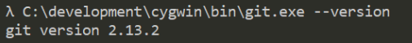

# &#8220;Описание моего изучения GIT от REBRAIN&#8221;

## Для чего необходим GIT?
***

GIT - это система, которая позволяет сразу нескольким разработчикам сохранять и отслеживать изменения в файлах вашего проекта. Или просто - система контроля версий. 

>Система контроля версий — это система, записывающая изменения в файл или набор файлов в течение времени и позволяющая вернуться позже к определённой версии. 


## Как установить GIT на Ubuntu?
***

Прежде чем устанавливать систему, необходимо обновить необходимые компоненты ОС:

```	
	$ sudo apt-get update -y 

```


Далее запустим установку с помощью команды:

```
	$ sudo apt install git

```

После установки убедимся, что система работает введем ```git --version``` и посмотрим на результат:




## Первое использование GIT
***

Далее по пунктам перечислено, что нужно сделать для отслеживания изменений

1. Зададим имя пользователя:
	
	```$ git config --global user.name "Клевый парень"```
	
	
2. Зададим почтовый ящик пользователя:

	```$ git config --global user.email клевый_парень@example.com```
	

3. Инициализировать дирректорию коммандой ```git init ```

4. Добавить файлы для отслеживания коммандой ```git add <имя_файла>``` Если файлов несколько, то можно выполнить ```git add .``` Это позволит добавить сразу все файлы в отслеживание

5. Выполнить коммит(сохранение действий) командой ```git commit```

6. После этого откроется файл редактора в котором требуется записать название коммита. Указываем название, сохраняем и закрываем

7. Убедиться, что все прошло успешно. Для этого посмотреть статус git. Используем команду ```git status``` Должно высветиться сообщение:

```

	On branch master
	
	nothing to commit, working tree clean

```
	
8. Посмотрим логи git коммандой ```git log``` должна появиться информация:

	Пример:
	
``` 
	$ git log
	
	commit 3b937b6eea460a52d23572849a87c572ea30f964
	
	Author: Gleb Aleksandrov <tecknogleb@gmail.com>
	
	Date:   Mon Feb 14 17:10:52 2022 +0300

    	edit file READMI.md
	
```

## Как подулючить удаленный репозиторий?
***

Для этого необходимо создать репозитории на хостингах

* [Gitlab](https://about.gitlab.com/)	

* [Github](https://github.com/)

* [Bitbucket](https://bitbucket.org/)


Далее выполняем подключение к репозиторию:

```git remote add <shortname> <url>```

Пример:

```git remote add pb https://github.com/paulboone/ticgit```

Просмотр добавленного репозитория:

```
	$ git remote -v
	
	origin	https://github.com/schacon/ticgit (fetch)
	
	origin	https://github.com/schacon/ticgit (push)
	
```

## Как добавить файлы в удаленный репозиторий?
***

Все очень просто. Используем комманду ```git push <remote-name> <branch-name>``` , где **branch-name** имя нашей ветки, которая по умолчанию называется *master* , 

**remote-name** - короткое имя удаленного репозитория.

Далее можно зайти на удаленный репозиторий и посмотреть на файлы, которые мы передали

## Как вернуться на предыдущий коммит?
***

Допустим у нас имеется ветка из нескольких коммитов:

```

$ git log

	commit 3b937b6eea460a52d23572849a87c572ea30f964

	Author: Gleb Aleksandrov 

	Date:   Mon Feb 14 17:10:52 2022 +0300

    	edit file READMI.md
	
	
	

	commit f9dfc7ab2d731b8ef14194a4cf657bf823f7e212

	Author: Gleb Aleksandrov 

	Date:   Mon Feb 14 17:09:25 2022 +0300

    	add file nginx.conf in git
	
	
	

	commit 6ac5541db8944afea03ff7020d97518c2300aeb6

	Author: Gleb Aleksandrov 

	Date:   Mon Feb 14 17:07:51 2022 +0300

    	add file README.md in git
	
```

Чтобы вернуться на ранний коммит и посмотреть изменения необходимо выполнить комманду:

```git checkout id_коммита```

После выполнения ```git checkout f9dfc7ab2d731b8ef14194a4cf657bf823f7e212``` мы вернемся на старые изменения

Если посмотреть ``` git log ``` то увидим:

```

$ git log


	commit f9dfc7ab2d731b8ef14194a4cf657bf823f7e212

	Author: Gleb Aleksandrov 

	Date:   Mon Feb 14 17:09:25 2022 +0300

    	add file nginx.conf in git
	
	
	

	commit 6ac5541db8944afea03ff7020d97518c2300aeb6

	Author: Gleb Aleksandrov 

	Date:   Mon Feb 14 17:07:51 2022 +0300

    	add file README.md in git
	
```

Чтобы вернуться на исходную позицию необходимо выполнить ```git checkout master``` тогда мы окажемся снова на последнем коммите.

## Теги в git
***

Существует два типа тегов:

* Легковесный тег — это что-то очень похожее на ветку, которая не изменяется — просто указатель на определённый коммит.

* Аннотированные теги - это теги, которые хранятся в базе данных Git как полноценные объекты. Они имеют контрольную сумму, содержат имя автора, его e-mail и дату создания, имеют комментарий

Для просмотра тегов служит команда ```git tag``` Например:

```

$git tag
	v0.1.1
	
```

Чтобы создать тег для коммита нужно ввести команду ```git tag v0.1 id_коммита```

Выполнив комманду можно посмотреть присвоился ли тег коммиту через ```git log``` :


```

$git log

	commit ed77c8a2deae258676c9347c653e87ab38b68fe7 (tag: v0.1)
	
	Author: Gleb Aleksandrov
	
	Date:   Mon Feb 14 02:08:23 2022 +0300

    	add file nginx.conf in directory
		
```
   
 Также по тегу можно посмотреть информацию по коммиту через ```git show имя_тега```. Будет произведен вывод всей информации по тегу :
 
 * Имя коммита
 
 * Создатель
 
 * Тег
 
 * Изменения в файле
